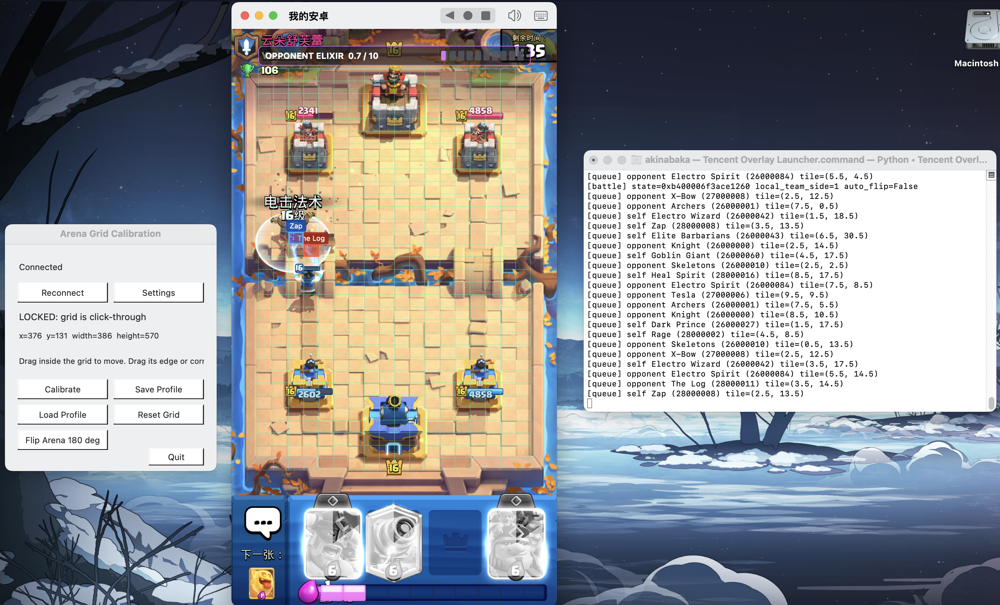

# 腾讯《皇室战争》部署队列网格覆盖层（macOS）

这是面向腾讯 Android arm64 客户端的 macOS 桌面覆盖层。它会在竞技场画面上叠加 18x32 网格，显示部署队列中的卡牌位置、敌我归属，以及当前绑定到的对手圣水值。



本项目只包含运行源码与安装脚本，不包含游戏 APK、模拟器镜像、已提取的游戏库、对局记录或个人配置。

## 功能

- 在竞技场上显示 18x32 可校准网格。
- 标记部署队列中的卡牌位置，并以蓝色区分己方、红色区分对手。
- 在网格上方显示对手圣水，刷新频率为 10Hz。
- 根据本局 `battleState` 清理旧对局数据，避免上一局的指针残留。
- 根据本机队伍所在半场自动旋转网格 180 度；仍保留手动翻转按钮。
- 提供 macOS 设置窗口，可填写 ADB、模拟器端口、Frida、游戏包名和可选 APK 路径。
- 首次安装自动下载 ADB、Frida Server，并建立 Python 运行环境。

当前验证的游戏包名为：

```text
com.tencent.tmgp.supercell.clashroyale
```

游戏客户端更新后，原生偏移可能变化；若出现无队列事件、无圣水或 Frida 注入失败，应先确认客户端版本与此项目测试版本一致。

## 运行条件

- macOS 12 或更高版本。
- Python 3.12 或更高版本。
- 支持 arm64 的 Android 模拟器，例如 MuMu。
- 模拟器已开启 Root，且 ADB shell 能取得 `uid=0`。
- 已自行安装腾讯《皇室战争》客户端。
- 可通过 ADB 连接模拟器。MuMu 常用地址为 `127.0.0.1:5555`，但不同实例的端口可能不同。

## 首次安装

1. 将仓库下载或克隆到本机。
2. 在 Finder 中双击 `Setup.command`。
3. 首次运行会创建 `.venv`，安装 Python 依赖，并下载 Android Platform Tools 与 Frida Server。完成前不要关闭 Terminal 窗口。
4. 启动 MuMu，打开 Root，并安装、启动腾讯《皇室战争》。
5. 双击 `Tencent Overlay Launcher.command`。

首次运行时，网格、校准窗口会先出现，随后程序再后台连接模拟器。因此即使端口或路径错误，也可以从窗口直接修正，不需要修改脚本。

若 macOS 阻止执行 `.command` 文件，在 Finder 中按住 Control 点击文件，选择“打开”，再确认运行。

## 设置窗口

点击校准窗口中的 `Settings`，按你的模拟器环境填写。保存后点 `Save & Connect`，无需重启覆盖层。

| 项目 | 含义 | MuMu 常用值 |
| --- | --- | --- |
| ADB executable | 本机 `adb` 可执行文件路径 | 安装脚本下载的 `tools/platform-tools/adb` |
| ADB connect address | 让 ADB 主动连接的地址 | `127.0.0.1:5555` |
| ADB device serial | 后续命令使用的设备序列号 | 通常与上项相同 |
| Game package | 腾讯客户端包名 | `com.tencent.tmgp.supercell.clashroyale` |
| Frida local host | macOS 侧的转发地址 | `127.0.0.1:27042` |
| Frida Android port | Android 内 Frida Server 监听端口 | `27042` |
| Frida server binary | Android arm64 Frida Server 文件 | `tools/frida/frida-server-17.17.0-android-arm64` |
| APK | 游戏未安装时使用的 APK；已安装可留空 | 留空 |

当 `Connected` 出现在校准窗口中，表示 ADB、Frida Server 与游戏进程都已准备完成。进入对战后，对手首次部署卡牌时，圣水绑定和队列标记会开始更新。

## 网格校准

1. 点击 `Calibrate`，使网格接受鼠标操作。
2. 拖动网格内部移动位置；拖动边缘或角落调整大小。
3. 让网格边界与游戏竞技场边界对齐。
4. 点击 `Save Profile` 保存当前屏幕的网格位置。
5. 再次点击 `Lock Overlay`，网格恢复为鼠标穿透，不会影响游戏操作。

`Flip Arena 180 deg` 是手动朝向兜底。正常情况下，程序会在新对局检测到本机队伍半场后自动决定是否翻转；如果画面方向不正确，可使用此按钮临时修正。

## 日常使用

1. 启动模拟器和游戏，进入稳定大厅。
2. 双击 `Tencent Overlay Launcher.command`。
3. 等待校准窗口显示 `Connected`。
4. 进入对战。
5. 对手首次下牌后，顶部圣水条开始刷新；部署事件会在网格对应位置短暂标记。

后续不需要再次执行 `Setup.command`，除非删除了 `.venv`、`tools`，或需要重新下载 Frida/ADB。

也可以通过终端启动：

```bash
./run_overlay.sh
```

## 常见问题

### 点击 Connect 后显示设备不可用

确认模拟器正在运行，并在设置中检查端口。可以在终端执行：

```bash
tools/platform-tools/adb connect 127.0.0.1:5555
tools/platform-tools/adb devices
```

将 `127.0.0.1:5555` 替换为你的模拟器端口。设备状态必须是 `device`，不能是 `offline`。

### 提示 ADB shell 不是 root

在模拟器设置中启用 Root，然后完全重启模拟器，再次点击 `Reconnect`。本项目需要 Root 才能部署并运行 Android 侧 Frida Server。

### 网格显示正常，但没有卡牌标记或圣水

先确认校准窗口为 `Connected`，然后从稳定大厅重新进入一局对战。对手完成首次部署后，探针才会绑定当前对局的对手圣水。若仍没有事件，游戏版本可能已改变偏移。

### 网格方向相反

点击 `Flip Arena 180 deg` 立即修正。下一局开始时，自动朝向会重新计算。

### 终端提示 Python 环境缺失

重新双击 `Setup.command`，等待其完成。不要将其他项目的 `.venv` 复制到本项目中。

## 配置与隐私

本机设置保存在 `config/runtime_settings.json`，网格位置保存在 `config/arena_grid_profile.json`。二者均被 Git 忽略，不会在正常提交时上传。

请不要上传 APK、Token、Frida 二进制、`.venv`、日志或对局数据。使用前请确认你对所测试的软件和账号拥有授权，并自行遵守游戏服务条款。

## 致谢

本腾讯运行时由协作开发完成，基于 [Jason-XII/cr-memory-reader](https://github.com/Jason-XII/cr-memory-reader) 中 `queue_overlay` 子任务的 Null 服务器基线扩展而来，加入了腾讯客户端迁移、对局隔离、敌我和半场识别、对手圣水绑定、设置界面与可迁移启动流程。
